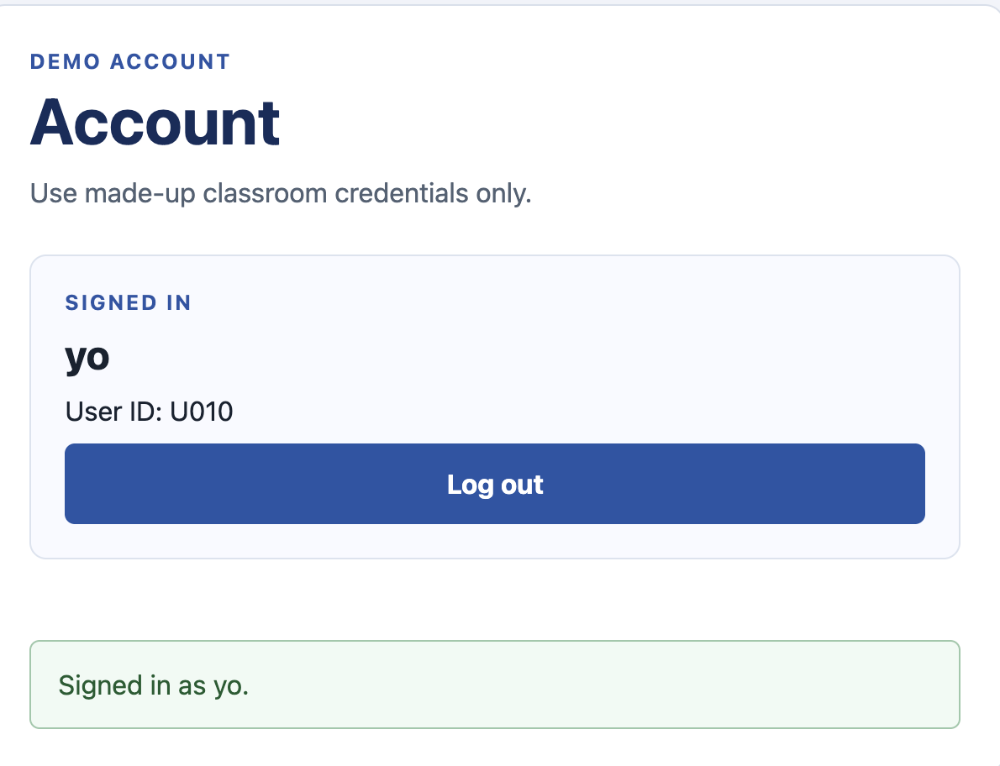
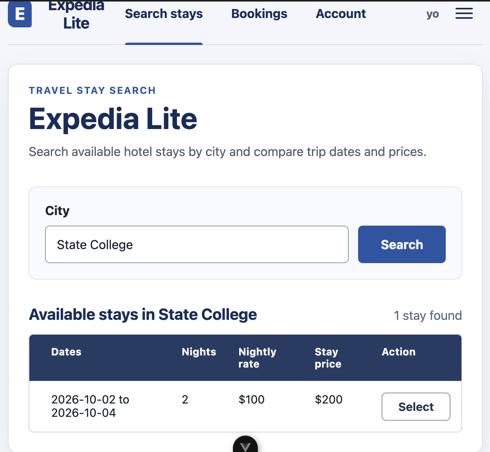
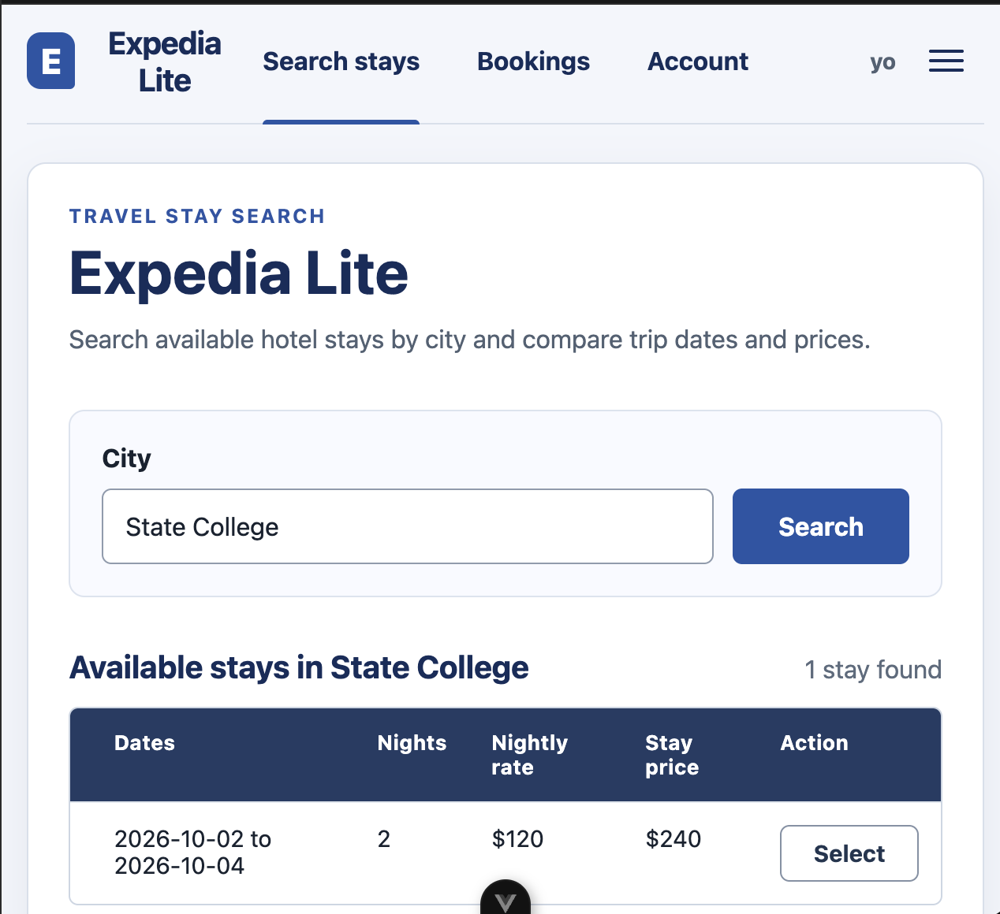

# Expedia Lite — Part 2 Report

## Repository and commit

- GitHub repository URL: https://github.com/FetrowSchool/Expedia-Lite
- Final Part 2 commit hash: https://github.com/FetrowSchool/Expedia-Lite/commit/c3d2d2b4cd961d45e88c9b2ead9ffd36a93cd33e

## Implementation

Database:

The app now uses SQLite for persistent data storage. Hotel, trip, user, and booking records are stored in the database while keeping the existing IDs and relationships.

Creating, reading, updating, and deleting records are handled with the Python backend and are shown to the Vue frontend through FastAPI.

Search:

The search functionality is mostly unchanged. Users can enter a search and receive matching hotel and stay information from the database.

Each search is now recorded in Search History for all signed-in users. Search History stores the user who searched, the search query, a timestamp, and result information.

Accounts:

The app has a basic account-creation feature. Users can create accounts with a unique username and password, log in and out, and access the history associated with their account. All new accounts receive unique user IDs.

Personalized pricing:

The app records searches made by signed-in users and uses Search History to determine how frequently a user has submitted the same search. The personalized-pricing feature multiplies the base price by 1.20 beginning with the second search for the same city on the same day. The increase is applied once and does not compound on additional searches.

MVC:

Model: Stores users, hotels, trips, bookings, and Search History in SQLite. User accounts extend the existing User data while preserving existing relationships.

View: The Vue frontend provides the existing search and booking functionality along with account controls and displays the prices returned by the backend.

Controllers: FastAPI routes connect the frontend to the Python backend. Account logic handles account creation, login, logout, and the current user. Search logic records searches, while pricing logic calculates the personalized price from Search History. Database operations are handled through the database controller.

## Verification

The application was manually checked in VS Code and in the browser.

Search expected behavior:

* Existing city search returns matching results.
* A search with no matches displays a clear no-results message.
* Submitted searches are recorded in Search History.
* Search History is associated with the correct signed-in user.
* Search History remains after restarting the application.

Account expected behavior

* New accounts can be created.
* Duplicate usernames are rejected.
* Correct login credentials successfully sign in.
* Incorrect login credentials fail.
* Logout clears the current user.
* New accounts receive unique user IDs.
* Existing user IDs and booking relationships remain valid.

Personalized Pricing Verification

For a hotel with a $100 stored base price:

* User A receives $100 on the first matching search.
* User A receives $120 on the second matching search.
* User A receives $120 on the third and later matching searches.
* User A continues receiving $120 instead of a compounded increase.
* User B starts at $100 for their first matching search.
* A different search query has a separate count.
* The next calendar day starts a separate count.
* The stored hotel base price remains $100.

Search Screenshot: 

No-results screenshot: 

Account creation: 

Personalized pricing: 

## Project context and next steps

Part 2 is implemented and verified. Bookings remain simulated, travelers come from starter data, and SQLite is local to one application instance. The next step is to add the final repository URL and Part 2 commit hash, review the submission.

- [README](README.md)
- [Project rules](AGENTS.md)
- [Design notes](docs/design.md)
- [Selected prompts](prompts/README.md)
- [Current handoff](handoffs/current.md)
