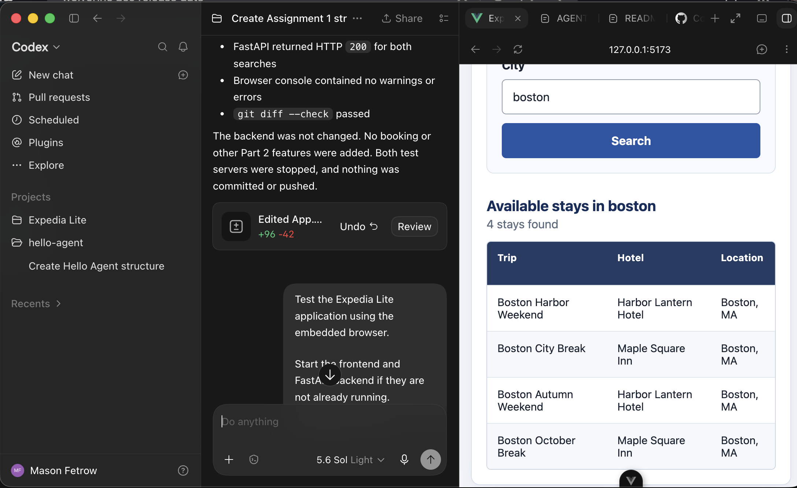

# ExpediaLite — Part 1

## Repository and commit
https://github.com/FetrowSchool/Expedia-Lite
c157832e02ace5cccc8c86ede9fd2c275d41a657

## Implementation
Expida lite is a travel app that lets users search for hotels by city. The frontend uses Vue to provide the user with a serach input as well as a result table. When a user sends their search, the frontend sends a request to the backend for resluts. This is done by the backend utilizing python to read the hotels.csv file. The frontend will then display the results in a table with columns labeling the city, hotel, and trip. 

## Verification
Action: Entered the city 'Boston' and clicked search.

Expected result: The application should display the hotel stays available in that city in a clear table below 

Observed result: The amtching hotel stays were displayed 

Screenshot: 

Action: Entered city "Shell City"

Expected result: The application should display a message stating there are no matching hotels. 

Observed result: The appliation displays the no hotels message.

Screenshot: 

## Project context and next steps

[ReadMe.MD](prompts/README.md) 
[Agent.MD](AGENTS.md)
[Prompts](prompts)
[Handoffs](handoffs)
[Design notes](docs/design.md)

The main limitation the app currently has is that it has a very limited set of data for it's hotel database. The next step for part two is to use SQLite to implement features like imulated booking, booking history, and status updates. These will be performed through the Vue frontend and FastAPI backend.