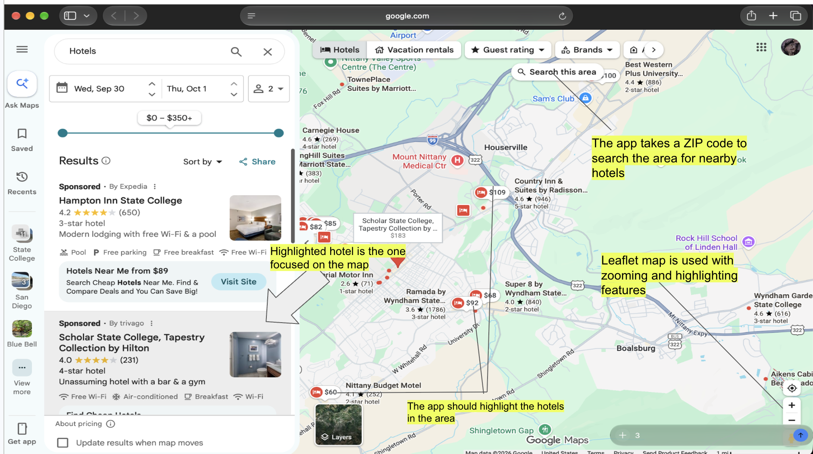
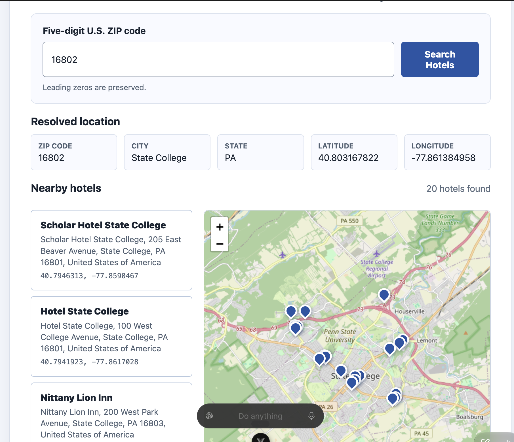
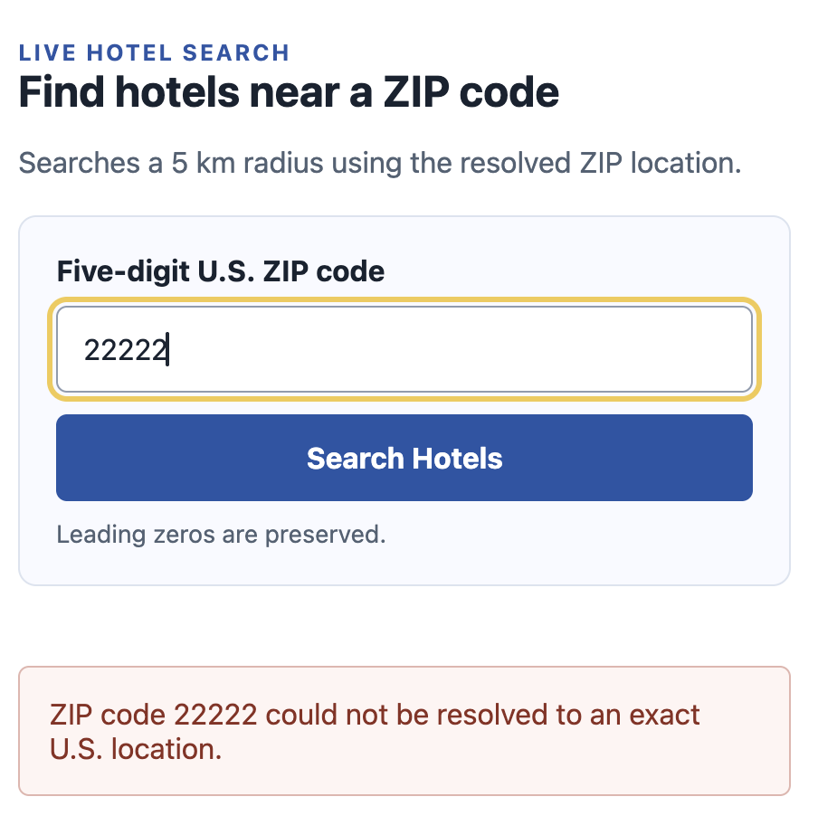

# Expedia Lite — Assignemnet 2 Part 1 Report

## Repository and commit

- GitHub repository URL: https://github.com/FetrowSchool/Expedia-Lite
- Final assignement 2 part 1 commit hash: https://github.com/FetrowSchool/Expedia-Lite/commit/c3d2d2b4cd961d45e88c9b2ead9ffd36a93cd33e

## Research and early mockup

Before I began the implementation of any features I reviewed and resarched Geoapify, Leaflet, FastAPI, and Vue to see how the ZIP lookup, hotel search, map, and frontend interactions should work.

Research sources:

* Geoapify Geocoding API: https://apidocs.geoapify.com/docs/geocoding/forward-geocoding/
* Geoapify Places API: https://apidocs.geoapify.com/docs/places/
* Leaflet: https://leafletjs.com/reference.html
* FastAPI: https://fastapi.tiangolo.com/
* Vue: https://vuejs.org/guide/introduction.html

After resarching I figured out that the ZIP codes needed to be handled as strings that way the leading zeros that are required could be perserved. Then Geoapify geocoding can turn a ZIP code into coordinates and the Places API can use those coordinates to search for the nearby hotels.

The app checks that the location given by Geoapify matches the requested ZIP code. Leaflet is used to display the returned hotels on a map. The hotel list and map share the same selected hotel so that selecting a hotel in one identifies the same hotel in the other. The app only displays hotel information given by the API.

Early mockup: 

## Implementation

ZIP search:

The app accepts a five digit US ZIP code. Zip coded are handled as strings so that they can start with leading zeros and reamin valid.

FastAPI sends the ZIP code to GEoapify and verifies that the returned location is a valid US postcode. If the ZIP can't be reconginzed, the app will not silently search for another location.

Hotel Search:

After the zip code is processed, the latitude and longitude returned by GeoApify are used as the center of the hotel search. FastAPI then uses Geoapify places API to display hotels in a 5 km radius of that center. The returned information is sent to the Vue frontend. The app displays available names, locations, addresses, and coordinates.

Map:

The Vue frontend uses Leaflet to display the search area and returned hotels. Each hotel is displayed in the hotel results list and as a marker on the map. Selecting a hotel in the list highlughts the corresponding marker on the map and vice versa.

Backend/API security:

Geoapify geocoding and Places requests pass through FastAPI.T he Geoapify API key is stored in the backend .env file. The .env file is excluded through .gitignore and is not committed to the repository. The backend Geoapify key is not stored in the Vue frontend.

Footer:

A samll footer has been added to the bottom of the page to create a more professional design closer to the UI of expedia. the footer has links to the search, booking history and accounts pages as well as information about the site itself.

## Verification

The application was manually checked in VS Code and in the browser.

ZIP search expected behavior:

* A valid five-digit U.S. ZIP code performs a search.
* ZIP codes are treated as strings so leading zeros are preserved.
* Invalid ZIP input displays an appropriate error.
* An unresolved ZIP displays a clear error.
* A Geoapify result that does not match the requested ZIP is rejected.
* The hotel search is centered on the coordinates returned for the requested ZIP.
* Hotels are searched within 5 km of the returned location.

Hotel results expected behavior:

* A successful search displays nearby hotels.
* Hotel information corresponds to data returned by the backend.
* Missing information is honestly omitted or labeled.
* No invented prices, ratings, availability, or booking confirmations are displayed.
* A successful search with no nearby hotels displays a no-results message.
* A failed request displays an error instead of being shown as an empty successful search.

Map expected behavior:

* Successful hotel results appear as Leaflet markers.
* Selecting a hotel from the list selects the corresponding hotel on the map.
* Selecting a map marker selects the corresponding hotel in the list.
* The list and map maintain the same selected hotel.

Application states expected behavior:

* Initial state displays the ZIP search interface.
* Loading state is displayed while a request is being processed.
* Successful searches display hotel results and the map.
* Invalid input has a separate error state.
* An unresolved ZIP has a separate state.
* No nearby hotels has a separate state.
* A failed request has a separate error state.

Successful hotel search: 

Hotel Selection: 

Invalid zip code: 

## Project context and next steps

Part 1 implemented live hotel searching using Geoapify, FastAPI, Vue, and Leaflet. ZIP codes are resolved through the backend and hotels within 5 km of the returned location are displayed as a map and a list.

The application distinguishes successful searches, invalid input, unresolved ZIP codes, no nearby hotels, loading, and request failures.

The next step is Part 2. Part 2 will extend the existing app by letting users save hotels returned by Geoapify to a list stored in SQLite. Users can then view and remove saved hotels, and the shortlist will remain available after browser and backend restarts.

- [README](README.md)
- [Project rules](AGENTS.md)
- [Design notes](docs/design.md)
- [Selected prompts](prompts/README.md)
- [Current handoff](handoffs/current.md)
